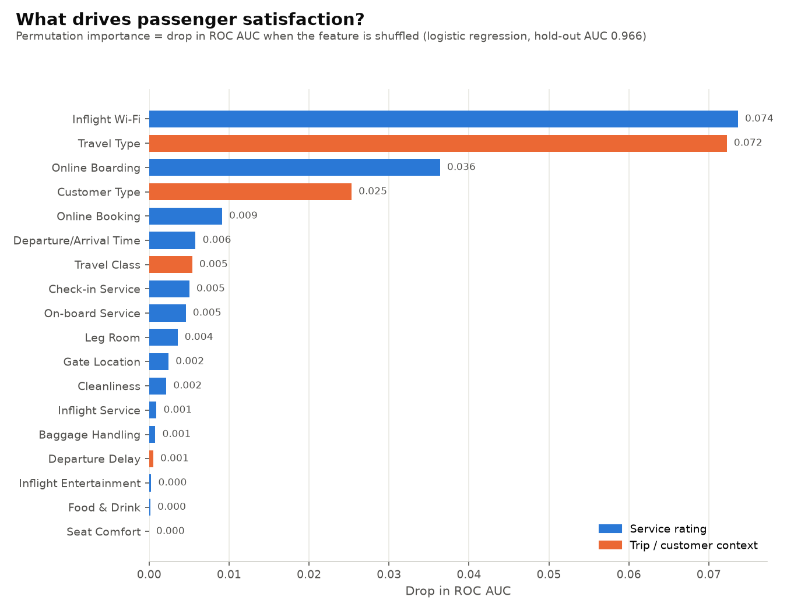
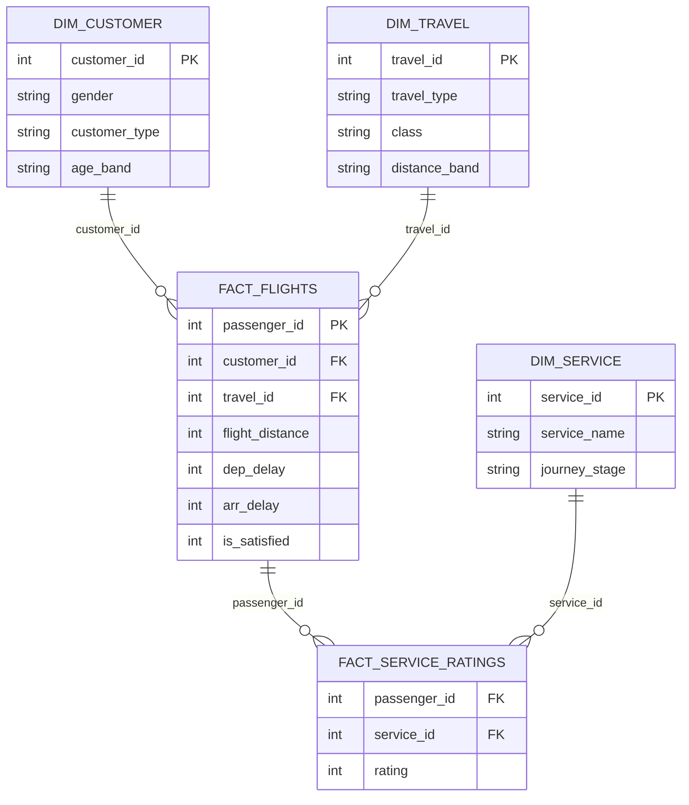

# Airline Customer Satisfaction & Loyalty Analytics

An end-to-end analytics project on **129,880 airline passengers**. Python cleans the data and
models what drives satisfaction. Power BI turns it into a four-page dashboard on top of a
star-schema semantic model.



> 📊 **Dashboard preview:** *add `screenshots/dashboard.gif` after building the report in Power BI Desktop (see [build guide](docs/dashboard_build_guide.md)).*
> 🔗 **Live report:** *add the Power BI Service / Publish-to-web link here.*

---

## Business questions

1. What drives dissatisfaction: service quality, delays, or travel class?
2. Which customer segments are most at risk of being dissatisfied?
3. How much do departure delays (>15 min, >60 min) reduce satisfaction?
4. Which 3 services should the airline fix first for the biggest gain?

## Tools

| Layer | Tools |
|---|---|
| Data prep | Python · pandas · NumPy |
| Modelling | scikit-learn: logistic regression and permutation importance |
| EDA | Jupyter · matplotlib · seaborn |
| BI | Power BI Desktop · Power Query (M) · DAX · TMDL / Power BI Project (`.pbip`) |
| Quality | pytest |

## Key findings

*All numbers come from `scripts/clean.py`, `scripts/driver_analysis.py` and
`notebooks/01_eda.ipynb` on the full dataset (train + test).*

1. **Fewer than half of passengers are satisfied: 43.4%.** Business class reaches 69.4%.
   Economy is at 18.8% and Eco Plus at 24.6%.
2. **Why people travel matters more than the ticket they buy.** Business travellers are 58.4%
   satisfied, personal travellers only 10.1%. Travel type is the #2 driver in the model,
   ahead of class. Even personal travellers in Business class are only 11.7% satisfied.
3. **Loyalty halves the risk.** Loyal customers are 47.8% satisfied and disloyal customers
   24.0%, a gap of 23.8 pts. The biggest at-risk groups by headcount:
   - **Loyal, personal-travel Economy passengers:** 32,821 passengers, 10.2% satisfied,
     ~29,500 dissatisfied. This is the largest block of unhappy customers, and they are the
     airline's *loyal* base.
   - **Disloyal, business-travel Economy passengers:** 13,450 passengers, 14.4% satisfied.
   - Age bands **<18 (16.7%)** and **60+ (20.8%)** also sit far below the 46–60 band (57.4%).
4. **Delays hurt, but less than you'd think.** 22.1% of passengers depart more than 15 min late.
   Satisfaction falls from **45.9% on time → 37.0% (>15 min) → 35.9% (>60 min)**, a
   9–10 pt penalty for the delayed group. Across the whole airline, though, eliminating **every**
   >15 min delay would lift satisfaction by only **+1.8 pts** (to 45.3%). Once service ratings
   are controlled for, departure delay ranks 15th of 18 drivers.
5. **Digital touchpoints are the top service levers.** Inflight Wi-Fi is the #1 driver and has
   the lowest average rating (2.81 / 5). Satisfaction is 25–33% when Wi-Fi is rated 1–3 and
   **99%** when it's rated 5. Online boarding shows the biggest satisfied-vs-dissatisfied
   rating gap (+1.45). Passengers who rate it 4–5 are 62–87% satisfied, against ≤14% for
   ratings of 1–3.

### Validation: Python vs Power BI

The logistic regression reaches **ROC AUC 0.966 / 90.4% accuracy** on a 25% hold-out set.
Top five drivers by permutation importance:

| Rank | Driver | AUC drop |
|---:|---|---:|
| 1 | Inflight Wi-Fi | 0.074 |
| 2 | Travel type | 0.072 |
| 3 | Online boarding | 0.036 |
| 4 | Customer type | 0.025 |
| 5 | Online booking | 0.009 |

*Power BI Key Influencers (page 3): record its top factors here after building the report and
note whether they match this list.*

Caveat: in-flight ratings such as seat comfort, entertainment, cleanliness and food are
strongly correlated with each other (r ≈ 0.58–0.68), so the model splits credit between them.
Their low individual importance does not mean they are irrelevant.

## Recommendations

**Fix these three services first.** The model estimates what satisfaction would be if every
applicable rating for a service rose by one point:

| Priority | Service | Avg rating | Projected gain (+1 pt) |
|---:|---|---:|---:|
| 1 | **Online boarding** | 3.33 | **+5.7 pts** |
| 2 | **Inflight Wi-Fi** | 2.81 | **+5.6 pts** |
| 3 | **Online booking** | 2.88 | **+2.3 pts** |

Each of these three is worth more than eliminating all delays (+1.8 pts). All three are
digital, which makes them cheaper and faster to improve than cabin hardware.

1. **Upgrade inflight Wi-Fi** (coverage, speed, simple pricing). It is the lowest-rated service
   and the strongest single driver.
2. **Streamline online boarding and booking** (mobile boarding passes, fewer booking steps,
   fewer errors).
3. **Win back the loyal leisure flyer.** Target loyal, personal-travel Economy passengers
   (~29.5k dissatisfied) with loyalty-tier perks such as Wi-Fi included, seat selection and
   upgrade offers.
4. **Convert disloyal business travellers** in Economy with corporate fares and a status match.
5. **Treat delays as a hygiene factor.** Keep on-time performance steady, but don't expect
   punctuality alone to move satisfaction much.

## Data model



See [docs/data_model.md](docs/data_model.md) for grain, row counts and design decisions, and
[docs/dax_measures.md](docs/dax_measures.md) for all 25 DAX measures, including the what-if delay projection.

## Dashboard pages

| Page | Purpose | Visuals |
|---|---|---|
| 1. Executive Overview | Headline health | KPI cards (Passengers, Satisfaction %, Delayed %, Avg Delay), satisfaction by class and travel type, slicers |
| 2. Customer Segments | Who is at risk | Age band × customer type matrix, donut by gender, bars by distance band and trip segment |
| 3. Service Drivers | What to fix | Key Influencers, service rating heatmap by class, Service Gap ranking |
| 4. Delay Impact | Cost of delays | Satisfaction % by delay bucket, scatter of delay vs satisfaction, what-if projection |

## How to run

```bash
git clone https://github.com/Ayush1860/ACSLA.git
cd ACSLA
python -m venv .venv && source .venv/bin/activate      # Windows: .venv\Scripts\activate
pip install -r requirements.txt

python scripts/download_data.py        # Kaggle API if configured, else a public mirror
python scripts/clean.py                # -> data/processed/*.csv (star schema)
python scripts/driver_analysis.py      # -> screenshots/driver_importance.png
python scripts/build_notebook.py --execute   # (re)build + run notebooks/01_eda.ipynb
python -m pytest                        # unit tests for the cleaning logic
```

Then open **`powerbi/AirlineAnalytics.pbip`** in Power BI Desktop, point the `DataFolder`
parameter at your `data/processed/` folder (Transform data → Edit parameters) and refresh.
Full steps: [docs/dashboard_build_guide.md](docs/dashboard_build_guide.md).

`python scripts/build_pbip.py` regenerates the Power BI semantic model, the report pages and
`docs/dax_measures.md` from one definition.

## Repository structure

```
ACSLA/
├── data/
│   ├── raw/                      # Kaggle CSVs (gitignored)
│   └── processed/                # star-schema CSVs (gitignored) + driver/uplift results
├── notebooks/
│   └── 01_eda.ipynb              # distributions, segments, delays, correlations
├── scripts/
│   ├── download_data.py          # Kaggle API or public mirror
│   ├── clean.py                  # nulls, types, bands, star-schema export
│   ├── driver_analysis.py        # logistic regression + permutation importance + what-if
│   ├── build_notebook.py         # generates the EDA notebook
│   └── build_pbip.py             # generates the Power BI project + DAX docs
├── powerbi/
│   ├── AirlineAnalytics.pbip
│   ├── AirlineAnalytics.SemanticModel/   # TMDL: tables, Power Query, relationships, measures
│   ├── AirlineAnalytics.Report/          # 4 report pages
│   └── theme/AirlineTheme.json
├── docs/
│   ├── dax_measures.md
│   ├── data_model.md
│   └── dashboard_build_guide.md
├── screenshots/                  # charts + dashboard captures
├── tests/test_clean.py
├── requirements.txt
└── README.md
```

## Data

[Airline Passenger Satisfaction](https://www.kaggle.com/datasets/teejmahal20/airline-passenger-satisfaction)
(Kaggle, 129,880 passengers). It contains gender, customer type, age, travel type, class,
flight distance, 14 service ratings (0 = not applicable, 1–5), departure and arrival delay,
and satisfaction. Raw files are not committed. `scripts/download_data.py` fetches them.
