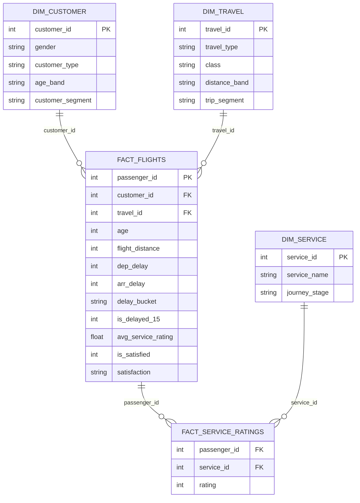

# Data Model

Star schema built by `scripts/clean.py` and loaded into Power BI by the Power Query
partitions in `powerbi/AirlineAnalytics.SemanticModel`.

## Tables

| Table | Grain | Rows | Notes |
|---|---|---:|---|
| `Fact_Flights` | one passenger journey | 129,880 | Train + test splits combined (`source_split` kept, hidden). |
| `Dim_Customer` | gender × customer type × age band | 20 | Junk dimension; `age_band` sorted by `age_band_order`. |
| `Dim_Travel` | travel type × class × distance band | 18 | Junk dimension; `class` and `distance_band` have sort-order columns. |
| `Fact_Service_Ratings` | one passenger × one service | 1,818,320 | The 14 rating columns unpivoted. `rating = 0` means *not applicable*. |
| `Dim_Service` | one rated service | 14 | Readable name + journey stage (Pre-flight / Airport / In-flight). |
| `Delay Reduction` | what-if value | 21 | Calculated table 0–100 in steps of 5. |

## Relationships

All single-direction, many-to-one:

| From (many) | To (one) |
|---|---|
| `Fact_Flights[customer_id]` | `Dim_Customer[customer_id]` |
| `Fact_Flights[travel_id]` | `Dim_Travel[travel_id]` |
| `Fact_Service_Ratings[passenger_id]` | `Fact_Flights[passenger_id]` |
| `Fact_Service_Ratings[service_id]` | `Dim_Service[service_id]` |

Filters therefore flow **Dim_Customer / Dim_Travel → Fact_Flights → Fact_Service_Ratings**,
so a class or customer-type slicer also filters the service ratings, and
`CALCULATE([Avg Service Rating], Fact_Flights[is_satisfied] = 1)` works without
bidirectional filtering.

## Design decisions

- **Ratings in their own fact table.** The plan's `DIM_SERVICE (passenger_id, service_name, rating)`
  is really a second fact at passenger × service grain. Splitting it into
  `Fact_Service_Ratings` (3 integer columns) + a 14-row `Dim_Service` cuts the CSV from ~98 MB
  to ~19 MB and lets service attributes (journey stage) be added in one place.
- **Junk dimensions** for customer and travel attributes keep the fact narrow while giving
  slicers clean, sortable columns.
- **Rating 0 = not applicable**, so every rating measure filters `rating > 0`.
- **Missing arrival delay** (393 rows, 0.3%) is filled with the departure delay
  (correlation 0.97), falling back to the median.
- **Bands:** age `<18, 18-30, 31-45, 46-60, 60+`; departure delay `On time (0), 1-15, 16-60, 60+ min`;
  distance `Short (<1000), Medium (1000-3000), Long (3000+)`.
